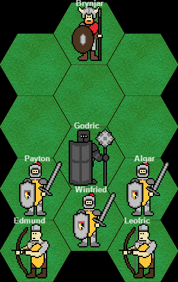
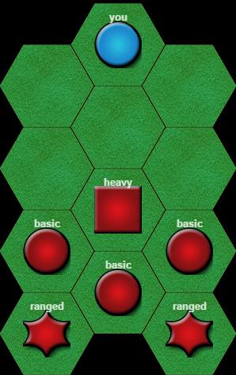

The source code for the HexGame variants used in my assessment can be found at [this](https://github.com/bedder/bedder.github.io/tree/5c04f00a3c23686ceea3aad7d9901d793a6cb107/demos/hexgame) location. The two variants of the game, with and without personified graphics, can be played by clicking one of the images below. Note that, although that version is **currently** the same as the versions used in my RIGI experiments, those URLs can may change over time (as I might decide to develop HexGame further). If this is the case I'll keep a copy of the original versions of the game and update the links here!

Note that these games were created and tested entirely in Chrome, so may not work in any other browsers. I don't *think* I've done anything webkit specific, but just be aware that on other platforms your mileage may vary!

	
	

