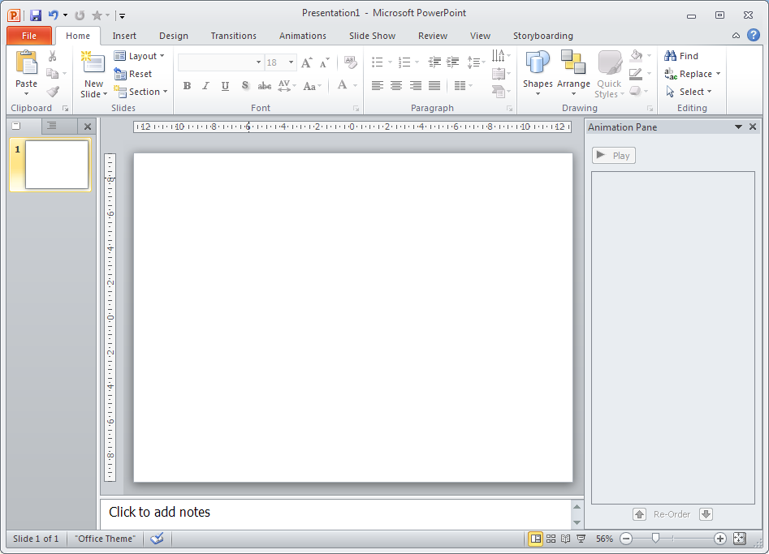
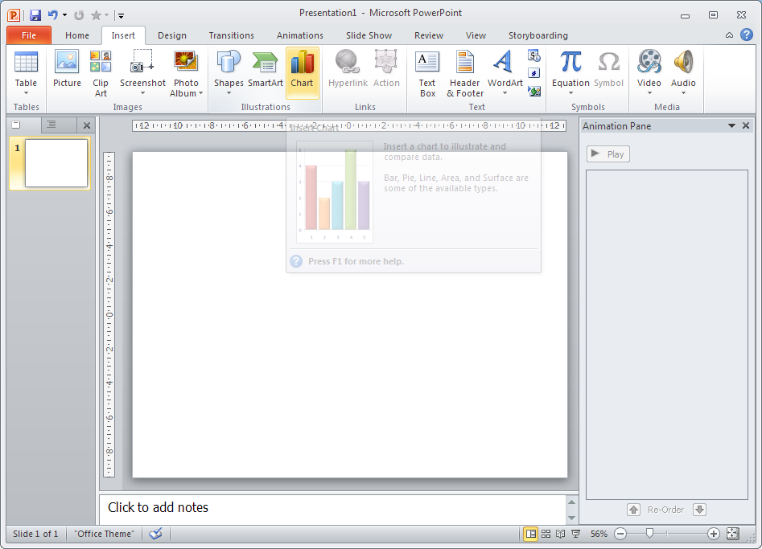
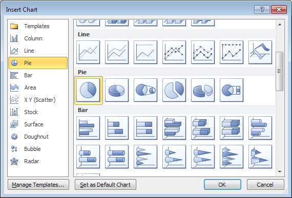
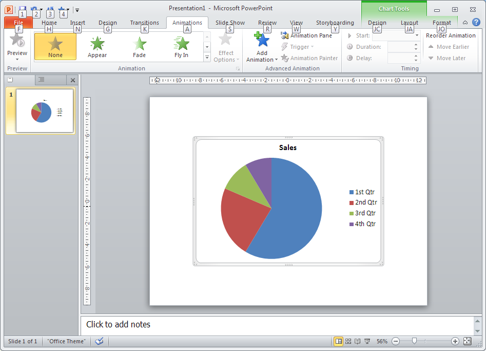
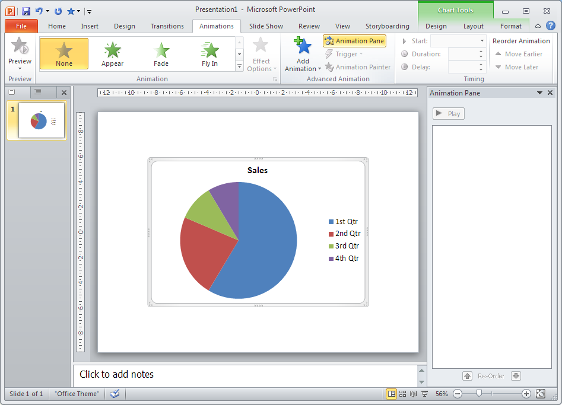
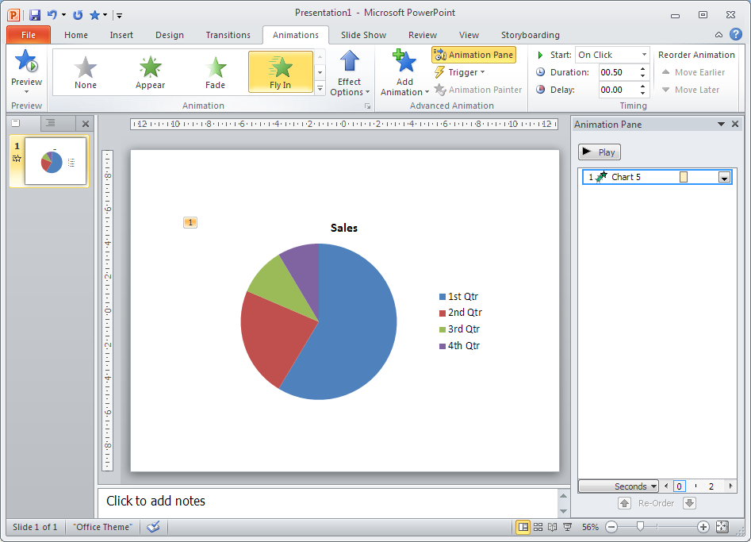
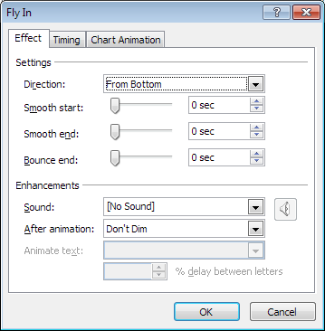
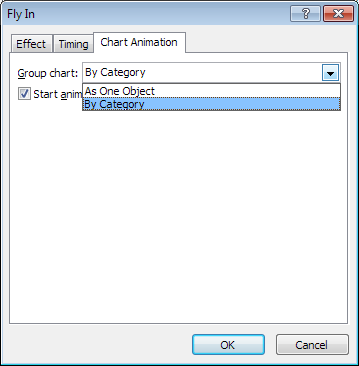

Starting from a standard PowerPoint slide...

	

		
	

Add a Pie Chart using the ``Insert -> Chart`` UI.

	

		
		
	

Open the ``Animation`` tab on the top ribbon, then open the ``Animation Pane`` if it isn't already.

	

		
		
	

Select the pie chart, and add the ``Fly In`` animation using the top ribbon. This should now appear in the ``Animation Pane``.

	

		
	

Click the dropdown box next to the animation in the ``Animation Pane`` and select ``Effect Options`` (I have no pictures for this D:).

In the new window, open the ``Chart Animation`` tab and select the ``By Category`` option.

	

		
		
	

Each part of the Pie Chart should now animate in individually - you can now go into the ``Animation Pane`` and change how each segment is animated.